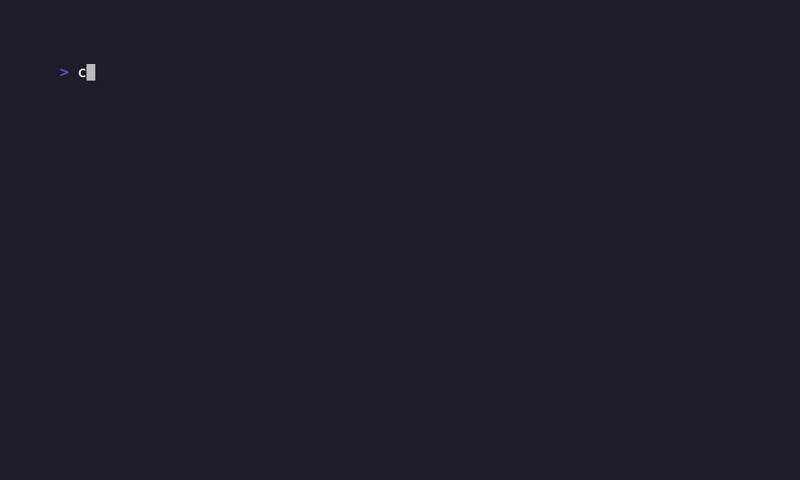

# clipaste

[](https://www.npmjs.com/package/clipaste)
[](https://github.com/markomanninen/clipaste/actions/workflows/ci.yml)
[](https://codecov.io/gh/markomanninen/clipaste)
[](https://opensource.org/licenses/MIT)
[](https://nodejs.org/)

A cross-platform command-line tool for clipboard operations - paste, copy, and manage text and images with file persistence.




## Why clipaste over pbcopy/pbpaste?

| Feature | pbcopy/pbpaste | clipaste |
|---------|---------------|----------|
| **Cross-platform** | ❌ macOS only | ✅ macOS, Windows, Linux |
| **File persistence** | ❌ Memory only | ✅ Save to organized files |
| **Image support** | ❌ Text only | ✅ Extract images from clipboard |
| **Content detection** | ❌ No type detection | ✅ Auto-detect text/image/binary |
| **Organization** | ❌ No file management | ✅ Custom paths, filenames, timestamps |
| **Backup/Archive** | ❌ Lost when overwritten | ✅ Permanent file storage |
| **Format conversion** | ❌ No processing | ✅ PNG, JPEG, WebP conversion |

### Real-World Advantages

**🖼️ Direct Image Extraction:**

```bash
# Impossible with pbcopy - copy image in GUI, then:
clipaste paste --filename "screenshot" --format png
# Creates actual PNG file from clipboard image data
```

**🌐 Cross-Platform Teams:**

```bash
# Same command works for Mac, Windows, Linux users:
clipaste paste --output ./shared-notes --filename "meeting-summary"
```

**📁 Organized Workflow:**

```bash
# Automatic organization with timestamps and unique names:
clipaste paste  # → clipboard-2025-09-14T12-30-45-uuid.txt
```

**🎯 Smart Content Handling:**

```bash
clipaste status  # Shows: "Clipboard contains: image content" 
clipaste paste   # Automatically saves as .png with proper format
```

## Features

- **Cross-platform clipboard access** - Works on macOS, Windows, and Linux
- **Intelligent content detection** - Automatically identifies text, images, or binary data
- **Image extraction and conversion** - Extract clipboard images as PNG, JPEG, WebP files
- **Organized file management** - Custom paths, filenames, and automatic timestamps
- **Base64 image support** - Decode data URLs to actual image files
- **Dry-run mode** - Preview operations without creating files
- **Multiple output formats** - Support for various image formats with quality control
- **Permanent archiving** - Never lose clipboard content when it's overwritten

## Installation

### NPM (Recommended)

```bash
# Install globally
npm install -g clipaste

# Or use npx (no installation required)
npx clipaste --help
```

### From Source

```bash
# Clone repository
git clone https://github.com/markomanninen/clipaste.git
cd clipaste

# Install dependencies
npm install

# Link globally (optional)
npm link
```

### System Requirements

- **macOS**: No additional requirements
- **Windows**: No additional requirements  
- **Linux**: Requires `xclip` or `xsel`
- **Node.js**: >=16 (tested on 16, 18, 20, 22). Recommended: Active LTS (20). Older Node 14 is no longer supported.

> Note: The project depends on the ESM-only `clipboardy` package. In this CommonJS codebase it's loaded via dynamic `import()` internally—no action needed from the user.

```bash
# Ubuntu/Debian
sudo apt-get install xclip

# CentOS/RHEL/Fedora
sudo yum install xclip
# or
sudo dnf install xclip

# Arch Linux
sudo pacman -S xclip
```

## Usage

### Basic Commands

```bash
# Copy text to clipboard
clipaste copy "Hello World"

# Copy file contents to clipboard
clipaste copy --file myfile.txt

# Output clipboard content to stdout (like pbpaste)
clipaste get

# Paste clipboard content to a file
clipaste paste

# Check clipboard status
clipaste status

# Clear clipboard
clipaste clear
```

### Copy Commands

```bash
# Copy text directly
clipaste copy "Some text content"

# Copy file contents
clipaste copy --file README.md

# Copy from pipe
echo "Piped content" | clipaste copy
```

### Get Commands

```bash
# Output clipboard to stdout
clipaste get

# Raw output without newline
clipaste get --raw

# Pipe clipboard content to other commands
clipaste get | grep "pattern"
clipaste get | wc -l
```

### Paste Options

```bash
# Paste to specific directory
clipaste paste --output ./downloads

# Paste with custom filename
clipaste paste --filename my-clipboard-content

# Force content type
clipaste paste --type text

# Image format options
clipaste paste --format jpeg --quality 80

# Preview operation without saving
clipaste paste --dry-run
```

### Clear Options

```bash
# Clear with confirmation prompt
clipaste clear --confirm

# Backup before clearing
clipaste clear --backup
```

### Examples

```bash
# Basic workflow
clipaste copy "Meeting notes from today..."
clipaste get  # Verify content
clipaste paste --filename "meeting-notes"

# File operations
clipaste copy --file config.json
clipaste paste --output ./backup/

# Image handling
# (Copy image in GUI first, then:)
clipaste paste --format png --filename "screenshot"

# Integration with other tools
clipaste get | jq .  # Format JSON from clipboard
ls | clipaste copy   # Copy directory listing
```

### Watch and History

Real-time monitoring and opt-in history are available via the `watch` and `history` commands.

```bash
# Monitor clipboard and print actions (CTRL+C to stop)
clipaste watch --interval 1000 --verbose

# Only react to matching content and save to history
clipaste watch --filter "ERROR|WARN" --save

# Run a command when clipboard changes (content on stdin)
clipaste watch --exec "jq . | tee last.json" --once

# Stop conditions
clipaste watch --timeout 60000          # stop after 60s
clipaste watch --max-events 5           # stop after 5 changes
clipaste watch --idle-timeout 30000     # stop after 30s of no changes

# Privacy and resource controls
clipaste watch --no-persist             # do not write history to disk
clipaste watch --max-item-size 262144   # skip items larger than 256 KB
clipaste watch --max-items 100          # keep up to 100 entries
clipaste watch --no-echo --verbose      # suppress content previews in logs

# Inspect, restore, and export history
clipaste history --list
clipaste history --restore <id>
clipaste history --export backup.json
clipaste history --clear
```

Notes:

- Polling interval has a floor of 200ms (default 1000ms). Very low intervals can use more CPU, especially on Linux.
- `--exec` receives clipboard content on stdin and exposes env vars `CLIPASTE_TEXT` and `CLIPASTE_SHA256` for scripts.
- History is text-first by design. Image history is planned for a later phase.

## Development

### Install Dependencies

```bash
npm install
```

### Run Tests

```bash
# Run all tests
npm test

# Run tests with coverage
npm run test:coverage

# Run tests in watch mode
npm run test:watch

# CI environment testing
npm run test:ci-sim      # Simulate CI environment
npm run test:ci-check    # Check CI protections
npm run test:docker      # Test in Docker Ubuntu environment
```

> Note: `clipboardy` is ESM-only. The library is loaded via a lazy dynamic `import()` inside `src/clipboard.js`. Real functionality and smoke tests that directly exercise the dependency spawn child Node processes and also use dynamic `import()` to validate availability without converting the whole project to ESM.

> Windows / CI Soft-Fail Note: Real image parsing tests (`real-image-handling.test.js`) embed inline scripts via `node -e`. On Windows or certain CI runners, path escaping and line-ending normalization can occasionally cause transient parse failures inside those ephemeral child processes. The tests include a guarded "soft-fail" path that logs diagnostics (prefixed with `WINDOWS_SOFT_FAIL` or warning messages) while still passing to avoid flaky builds. If you are developing locally and see these warnings, inspect the logged inline script output; they do not indicate a product defect in normal operation, but rather a platform quirk in the spawned test harness. A future enhancement may move these scenarios to fixture files to eliminate inline script escaping issues.

### Linting

```bash
# Check code style
npm run lint

# Fix code style issues
npm run lint:fix
```

### Project Structure

```text
src/
├── index.js        # Main entry point
├── cli.js          # CLI interface and command handling
├── clipboard.js    # Clipboard operations
└── fileHandler.js  # File saving operations

tests/
├── clipboard.test.js     # Clipboard manager tests
├── fileHandler.test.js   # File handler tests
├── cli.test.js          # CLI tests
└── integration.test.js   # End-to-end tests

Additional Phase 2 files:

```text
src/
├── watcher.js       # Polling-based clipboard watcher
└── historyStore.js  # JSON-backed clipboard history with pruning

tests/
├── watcher.test.js        # Watcher unit tests (filter/exec/stop)
├── watch-smoke.test.js    # Smoke test writing to temp history.json
└── cli-watch-history.test.js # CLI wiring tests for new commands
```

## Platform Support

- macOS: Native clipboard access
- Windows: Native clipboard access
- Linux: Requires xclip or xsel

## License

MIT
